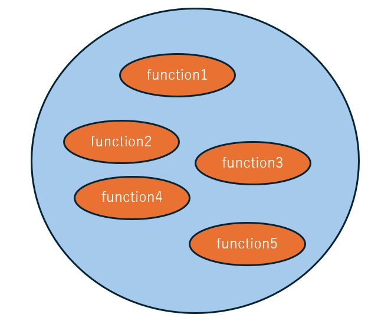
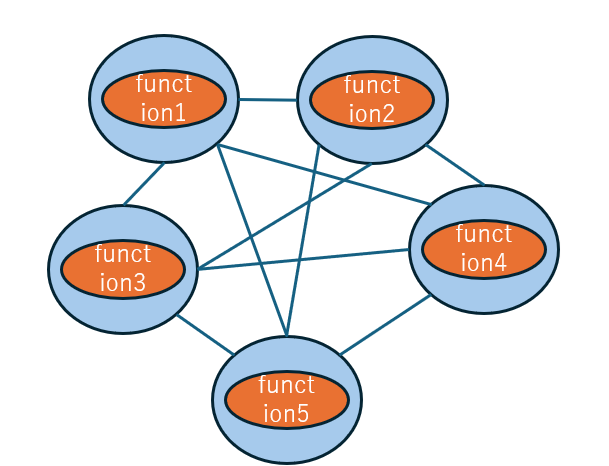

# The Relationship Between IT Technology and Spirituality
At first glance, IT technology and spirituality may seem unrelated, but they are actually closely connected.
Spiritually, the period from the 1800s to 2020 is called the Age of Earth, and the approximately 200 years from 2021 are called the Age of Wind. 

| Era | Characteristics | Notes |
|-----------|-----------|-----------|
| Age of Earth (1800s-2020) | ・ Emphasis on tangible things like money, status, and fame  ・ Centralized society such as government and nation ||
| Age of Wind (approximately 200 years from 2021) | ・ Emphasis on intangible things like individuality, love, and harmony ・ Decentralized society (DAO society※1) | ※1 Refer to [Community of the Age of Wind](https://github.com/windagecat/The-World-of-the-Age-of-Wind/blob/main/Community_Age_of_Wind.md) |

In IT systems, there are monolithic (traditional) and microservices (trendy).

1. Monolithic

2. Microservices

| Type of IT System | Characteristics | Representative Technology |
|-----------|-----------|-----------|
| ① Monolithic | Integrated system that consolidates necessary functions on a single server as much as possible | Traditional IT systems in general |
| ② Microservices | Decentralized system that divides necessary functions across servers and operates them in coordination | Blockchain, Kubernetes |

As you may have guessed by now, the characteristics of the Age of Earth align with monolithic systems, and the characteristics of the Age of Wind align with microservices. 
In the Age of Earth, wealth and power were monopolized by a specific layer called DS, but in the upcoming Age of Wind, these will be decentralized, and an era where everyone can become prosperous is coming. 
Microservices can also be said to imply that each individuality is connected to each other.

Next, [I will explain about Microservices and the Kingdom of Tartaria](./microservices-and-the-kingdom-of-tartaria.md)