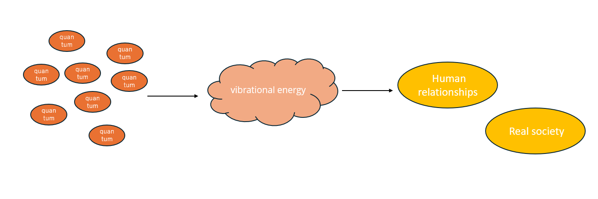

# The Universe
## The World of Quantum
The world we see in front of us is actually made up of quantum particles. 
Waves are formed from these quantum particles, and from these waves, the world of reality and human relationships is created.

Moreover, the content of this created world **changes according to our own consciousness and emotions**. In other words, quantum particles chemically react to each of our consciousness and emotions, forming waves accordingly, and creating the world in front of us. (**This is called the universe**)
## About Dimensions
There are levels corresponding to the waves, and these are the dimensions.
The higher the dimension, the closer it is to love, and the lower the dimension, the closer it is to material values.

| Dimension Level | Characteristics |
|---|---|
| 4th Dimension and above (Higher Dimensions) | ・Existence without a physical body, only a soul ・Values of love ・The time it takes for consciousness and emotions to be reflected in the created world is short |
| 1st to 3rd Dimensions (Lower Dimensions) | ・Existence with a physical body ・Material values ・The time it takes for consciousness and emotions to be reflected in the created world is long |

Love does not have a clear definition, but it refers to intangible things such as having an interest in a certain matter or technology (just wanting to try it), wanting to help others, or wanting to change the world. (The specific content varies depending on each person's way of thinking). 
Material values refer to tangible things such as status and fame.

However, there is no right or wrong based on the high or low dimension thinking. In the universe, it is based on each individual's free will to hold any values (the law of non-interference). 

Next, [I will explain about the future of Earth](./the-future-of-earth.md)