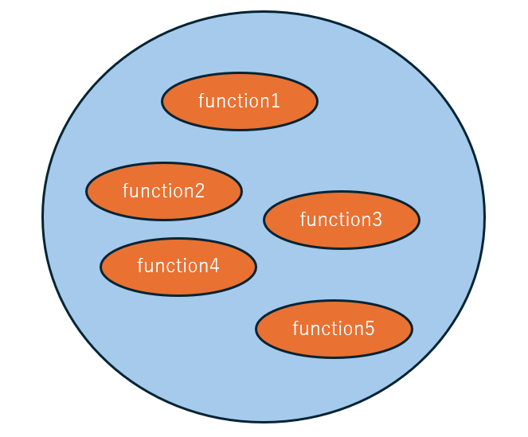
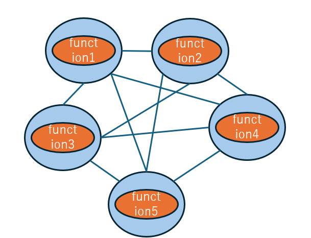

# IT技術とスピリチュアルの関係性
IT技術とスピリチュアルは、一見別物のように見えるが、実は大いに関係している。
スピリチュアル的には、1800年代～2020年までを土の時代、2021年からの約200年間を風の時代という。 

|時代|特徴|備考|
|-----------|-----------|-----------|
|土の時代(1800年代～2020年)|・ お金、地位、名誉などの具体的な形があるものを重視  ・政府や国といった中央集権社会 ||
|風の時代(2021年からの約200年間)|・個性、愛、調和といった形のないものを重視 ・分散型社会(DAO型社会※1) |※1 [風の時代のコミュニティ](https://github.com/windagecat/The-World-of-the-Age-of-Wind-JP-/blob/main/Community_Age_of_Wind.md#%E9%A2%A8%E3%81%AE%E6%99%82%E4%BB%A3%E3%81%AE%E3%82%B3%E3%83%9F%E3%83%A5%E3%83%8B%E3%83%86%E3%82%A3) を参照|

ITシステムには、モノシリック(従来型)とマイクロサービス(トレンド)が存在する。 
1. モノシリック

1. マイクロサービス

|ITシステムの種類|特徴|代表技術|
|-----------|-----------|-----------|
|①モノシリック|システムに必要な機能を、なるべく1つのサーバ上に集約する一体型|従来のITシステム全般|
|②マイクロサービス|システムに必要な機能をサーバ分割し、これらを連携して動作させる分散型|ブロックチェーン、Kubernetes|

ここまで読んでご察しの通り、土の時代の特徴とモノシリック、風の時代の特徴とマイクロサービスが一致する。 
土の時代では、富と権力をDSと呼ばれる特定層が独占していたが、これからの風の時代ではそれらは分散され、みんなが豊かになれる時代がやってくる。 
マイクロサービスは、それぞれの個性がお互いにつながりあう
ことを暗示しているとも言えるだろう。

次に[マイクロサービスとタルタリア王国について、説明する](./マイクロサービスとタルタリア王国.md)