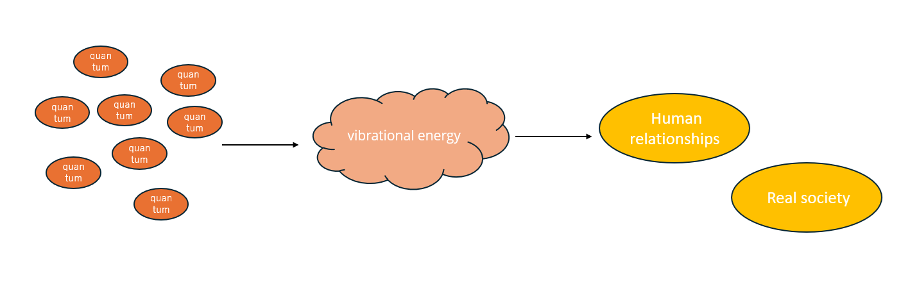

# 宇宙とは
## 量子による世界
私たちが今見ている(目の前の)世界は、実は量子によって成り立っている。 
量子から波動ができ、その波動から現実社会や人間関係の世界を作っている。

また、この作られた世界の内容は、**自身の意識及び感情により変化する**。つまり、私たちそれぞれの意識及び感情に対して、量子は化学反応し、それに応じた波動を形成し、目の前の世界が作られているのである。(**これを宇宙という**)
## 次元について
波動に応じたレベルが存在し、それが次元である。
次元が高いほど愛に近づき、低いほど物質的価値観に近づく。

|次元レベル|特徴|
|---|---|
|4次元～(高次元)|・肉体を持たず、魂だけの存在 ・愛の価値観 ・意識及び感情が、作り出される世界に反映されるまでの時間が短い|
|1～3次元(低次元)|・肉体を持つ ・物質的価値観 ・意識及び感情が、作り出される世界に反映されるまでの時間が長い|

愛は明確な定義はないが、例えばとある事柄や技術に関心があること(ただやってみたい気持ち)や、人の役に立つことをしたいや世の中を変えたいなどの、形のないものを指す。(具体的な内容は、人それぞれの考え方によって異なる)。 
物質的価値観とは、地位、名誉といった具体的な形のあるものを指す。

しかし、次元の低い高いや考え方による良しあしはない。宇宙では、どんな価値観を持つかそれぞれの自由意志で成り立っている(不干渉の法則)。 

次に[これからの地球について、説明する。](./これからの地球.md)

